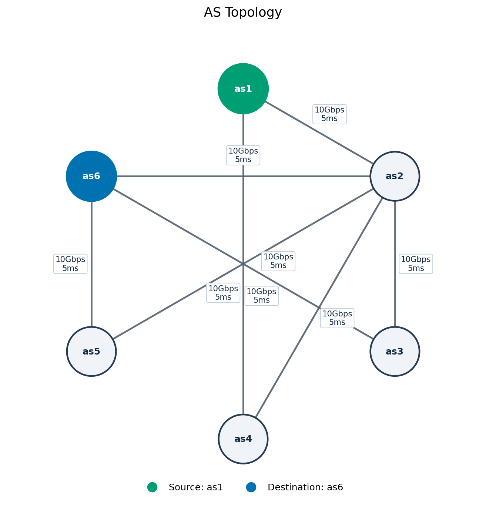
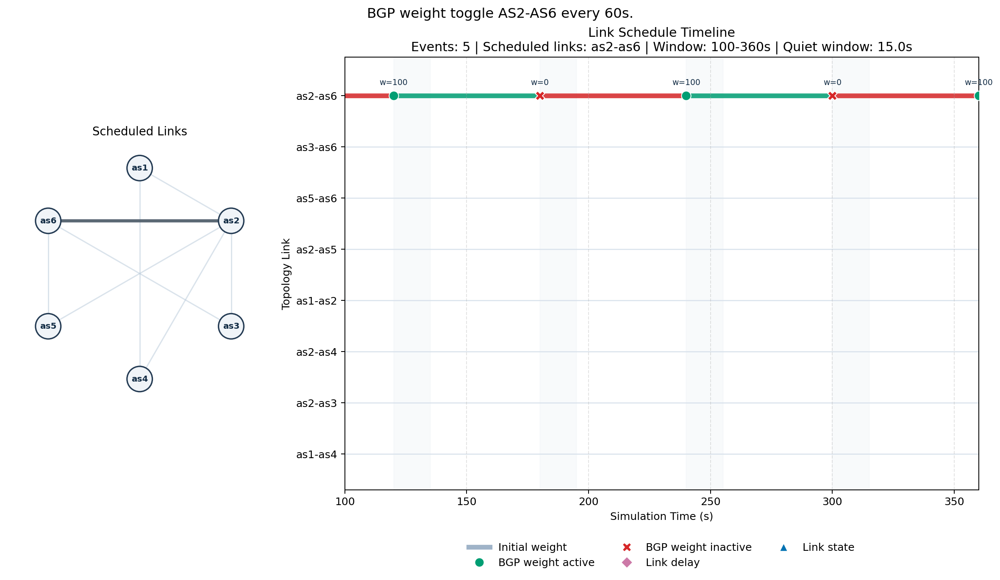

# BGP AS_PATH Convergence Demo

This demo is planned as a control-plane experiment for observing BGP AS_PATH route-event propagation across a reusable six-AS topology.


## Files

- `topology.json`: default AS topology, router identities, links, LAN prefixes, origin prefix, and initial link weights.
- `schedule.json`: default experiment schedule with measurement settings and BGP weight churn events.
- `run.sh`: local runner that syncs the STARS-owned demo source into an ns-3 checkout and invokes `bgp-aspath-convergence-example`.
- `bgp-aspath-convergence-example.cc`: current placeholder ns-3 entrypoint for runner/build validation.
- `wscript`: build wiring copied by `run.sh`.
- `visualize_topology.py`: renders `topology.json` as an AS graph with link capacity and delay labels.
- `visualize_schedule.py`: renders `schedule.json` and shows how the links go up and down
- `analyze_bgp_events.py`: Visualize the results from the test-run to show path convergence for each link.
## Quick Start

Run from this repository root with:

```bash
NS3_DIR="/path/to/ns-3/" run.sh
```

The runner accepts:

```text
--topology PATH
--schedule PATH
--bgp-trace PATH
--output-dir PATH
--allow-peer-reset
--force-peer-reset
--help
```

`NS3_DIR` must point to the ns-3 checkout. The runner fails before invoking waf if the topology or schedule file is missing.

Default run artifacts are written under:

```text
runs/<utc-timestamp>/
```

The run directory contains copied `topology.json`, copied `schedule.json`, and `run-summary.json`. The default BGP event log path is `bgp-events.csv` in the same directory once event logging is implemented.

## Topology


### Visualize the topology:

```bash
./visualize_topology.py --show
```




Save a topology image to a file:

```bash
./visualize_topology.py --topology topology.json \
		--source as1 --destination as6 \
		--output topology.png
```

## Schedule Plot

Visualize the link schedule over time:

```bash
./visualize_schedule.py --topology topology.json --schedule schedule.json --output schedule.png
```

Focus on a time window:

```bash
./visualize_schedule.py --topology topology.json --schedule schedule.json \
		--start 100 --end 360 --output schedule-window.png
```


## Topology Contract

The default topology uses exactly one BGP router per AS:

- AS IDs: `as1` through `as6`
- router IDs: `r-as1` through `r-as6`
- origin prefix ID: `as6-origin`
- link IDs: lowercase endpoint names in ascending AS order, for example `as2-as5`

AS1 and AS6 have LAN prefixes reserved for optional data-plane traffic:

- AS1 LAN: `192.168.1.0/24`
- AS6 LAN: `192.168.6.0/24`
- AS-LAN links use `1Gbps` capacity and `100us` delay by default.

The measured origin prefix is AS6's LAN:

```text
as6-origin = 192.168.6.0/24
```

### topology.json

The network is described in toplogy.json
It first describes the ASes, then the links between are listed (there
can be multiple links between ASes, each with different capacity, delay
and initial weight.


## Inter-AS Addressing

Inter-AS link addresses are derived from endpoint AS numbers and are not enumerated in `topology.json`.

For link `asX-asY`, where `X < Y`:

```text
subnet: 10.X.Y.0/30
asX endpoint: 10.X.Y.1
asY endpoint: 10.X.Y.2
```

Examples:

```text
as1-as2 -> 10.1.2.0/30, as1=10.1.2.1, as2=10.1.2.2
as3-as6 -> 10.3.6.0/30, as3=10.3.6.1, as6=10.3.6.2
```

## Link Policy Surface

Inter-AS links use `10Gbps` capacity and `500us` delay by default.

Each link defines `initial_bgp_weight`. This is an initial route-selection input for both directions of the link. Later schedule files may adjust directional weights with explicit `from` and `to` references; a link weight is not a direct instruction to use a path.

`weight` changes are measurement inputs, not imperative path-selection commands. They adjust the route-selection landscape and the simulator observes what BGP does with the resulting alternatives.

The current BGP wrapper applies peer `weight` to the peer configuration used when a BGP session is initialized. A scheduled weight update always updates the stored peer configuration and logs a `scenario_policy` event. By default, it does not reset the peer, so an already-established session may not re-read the updated weight until a later reconnect.

Reset policy options:

- default: apply weight updates in place and do not reset peers
- `--allow-peer-reset`: log that reset fallback is allowed, but no automatic fallback condition is implemented yet
- `--force-peer-reset`: reset the affected session and reconnect from the active side after each weight update

Runs using `--force-peer-reset` involve BGP session churn and should not be labeled as pure in-place policy convergence.


## Schedule Contract

`schedule.json` defines experiment events applied to `topology.json`.

Required measurement setting:

```json
{
  "measurement": {
    "convergence_quiet_time_s": 15.0
  }
}
```

Events are sorted by `time`, then by file order. Equal timestamps are valid and execute in file order. Every event must have a stable `id`, `time`, and `type`.

References to unknown AS IDs or link IDs are fatal configuration errors. Reapplying the same value is idempotent and should be logged deterministically as applied or no-op.

The default schedule keeps all physical links up. Link unavailability is modeled by `bgp_weight` events with `weight: 0` and `active: false`.

Supported event shapes:

```json
{
  "id": "example-weight",
  "time": 120.0,
  "type": "bgp_weight",
  "from": "as1",
  "to": "as2",
  "link_id": "as1-as2",
  "weight": 200,
  "active": true,
  "label": "Example weight change"
}
```

```json
{
  "id": "example-link-state",
  "time": 120.0,
  "type": "link_state",
  "link_id": "as1-as2",
  "state": "up",
  "label": "Example physical link state"
}
```

```json
{
  "id": "example-static-delay",
  "time": 120.0,
  "type": "link_delay",
  "link_id": "as1-as2",
  "mode": "static",
  "delay_ms": 0.5,
  "label": "Example static delay"
}
```

```json
{
  "id": "example-linear-delay",
  "time": 120.0,
  "type": "link_delay",
  "link_id": "as1-as2",
  "mode": "linear",
  "increment_ms": 0.1,
  "dt_s": 1.0,
  "label": "Example linear delay"
}
```

## Results analysis
The `analyze_bgp_events.py` script takes the simulation outputs (`bgp-events.csv`), along with the topological definition (`topology.json`) and the churn schedule (`schedule.json`), and generates a suite of timeline plots and convergence CSV metrics. 

These outputs allow researchers to observe how routing changes propagate through the network and specifically measure BGP path convergence delays.

### Requirements

The script requires Python 3 and `matplotlib`.

```bash
pip install matplotlib
```

### Usage


```bash
python3 analyze_bgp_events.py \
    --topology runs/<timestamp>/topology.json \
    --schedule runs/<timestamp>/schedule.json \
    --events runs/<timestamp>/bgp-events.csv \
    --output-dir runs/<timestamp>/
```

### Arguments

| Argument | Description |
|---|---|
| `--topology` | **(Required)** Path to the topology JSON file. |
| `--schedule` | **(Required)** Path to the schedule JSON file (prescribes link weight variations). |
| `--events` | **(Required)** Path to the `bgp-events.csv` file produced by the simulation. |
| `--output-dir` | *(Optional)* Directory to write the plotted `.png` and `.csv` files. If omitted, the script will show interactive Matplotlib windows instead of saving them. |
| `--prefix` | *(Optional)* Which routing prefix to analyze. Defaults to the one with the most `route_add` events. |

## Outputs

When `--output-dir` is provided, the script generates the following files:

### Visualizations (PNGs)

1. **`bgp-event-propagation.png`**
   Displays a timeline of every BGP event (added routes, withdrawn routes) grouped by the receiving router on the Y-axis. Includes dashed vertical lines representing the `schedule.json` simulated policy disturbances.

2. **`aspath-timeline.png`**
   A filtered view showing only `route_add` events. Points are color-coded based on a stable hash of the actual `AS_PATH` traversed, making it easy to identify when a new path physically propagates.

3. **`as1-path-convergence.png`**
   A step plot explicitly mapped to the viewpoint of AS 1 (`1.1.1.1`). It visually traces the exact path preferred by AS 1 over time smoothly between disturbances.

4. **`as1-convergence-delay.png`**
   A bar chart calculating the exact heuristic delay (in milliseconds) from when a scheduled topology disturbance begins, to the final `route_add` settling BGP back into a converged state at AS 1. It also calculates `min`, `max`, `avg`, and `std-dev` values below the chart.

### Tabular Metrics (CSVs)

1. **`aspath-convergence.csv`**
   Measures time proxies (how long the simulated network took after a disturbance before BGP events ceased within a threshold). Contains disturbance labels, observation counts, and convergence duration.

2. **`aspath-first-seen.csv`**
   Metrics mapping exactly when each individual path was first witnessed by each unique router in the AS network, appending withdraw counts and AS path churn changes alongside time.
