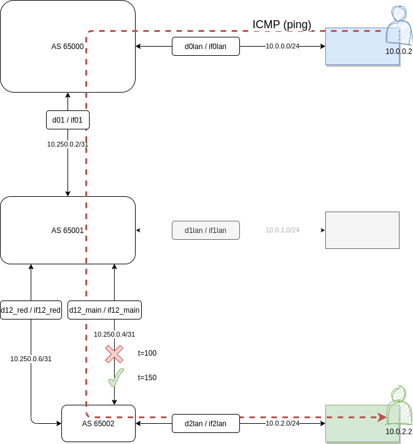
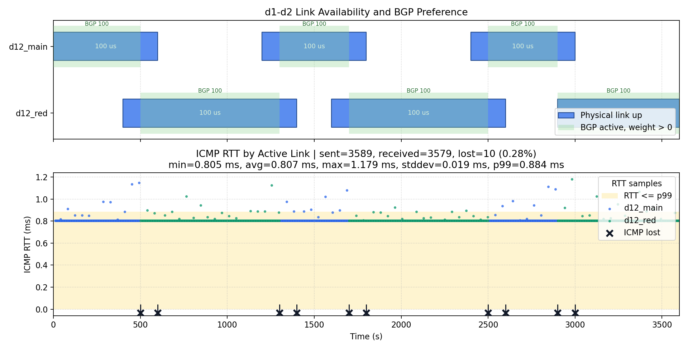

# STARS BGP Examples

This folder contains minimal, ready-to-use BGP example code for the ns-3 simulator.

## Simulated network


## Files

- **bgp-minimal-example.cc**: simulation entrypoint, runtime knobs, deterministic seed/run, ICMP summaries.
- **bgp-minimal-scenario.h/.cc**: scenario engine, system/scenario events, switchover scheduling.
- **bgp-minimal-state.h**: scenario state and event-stage progression.

## Quick Start (STARS-only edit flow)


```bash
NS3_DIR=/path/to/ns-3-dev ./run.sh
```


`run.sh` copies the STARS example files into `${NS3_DIR}/src/bgp/examples/`,
refreshes `wscript`, builds, and runs `bgp-minimal-example`.

## Runtime Knobs

The minimal runner accepts:

- `--link-config PATH`: path to the d1-d2 link schedule JSON.
- `--icmp-trace PATH`: CSV output path for ICMP RTT/loss samples.
- `--help`: show runner help.

Example:

```bash
NS3_DIR="/path/to/ns-3-dev" ./run.sh \
  --link-config bgp-minimal/d12-links.json \
  --icmp-trace /tmp/icmp-delay.csv
```

## Visualizing the results

The links (in d12-links.json) can be visualized and overlaid with the
results from the simulated links:
```bash

  python3 visualize_links.py d12-links.json --icmp-delay /tmp/icmp-delay.csv -o test.png
```


